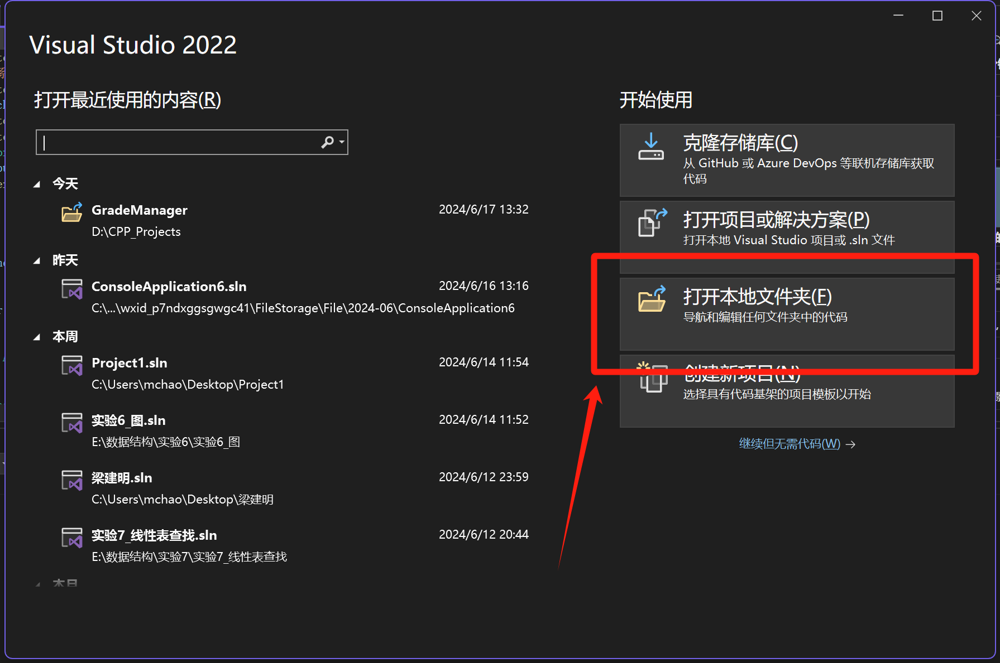
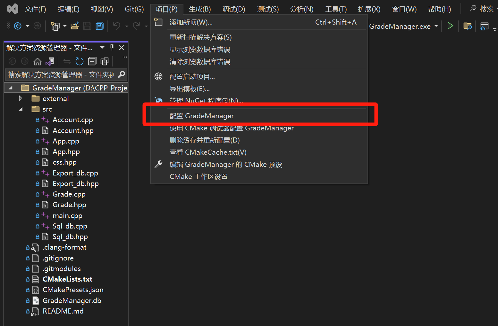
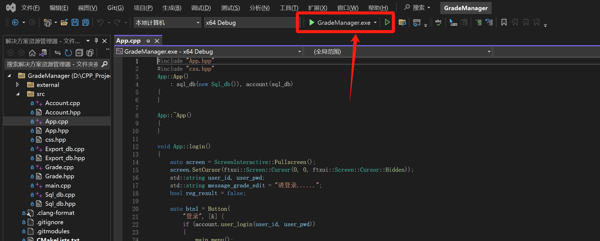
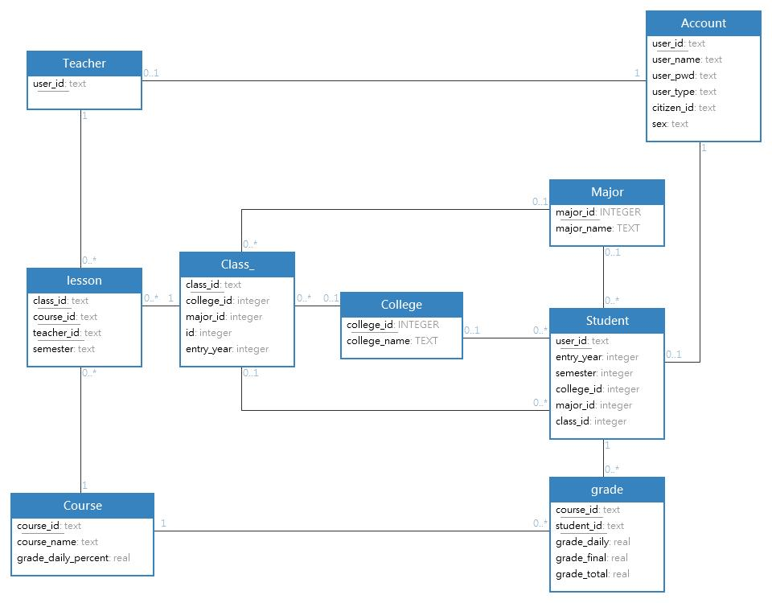
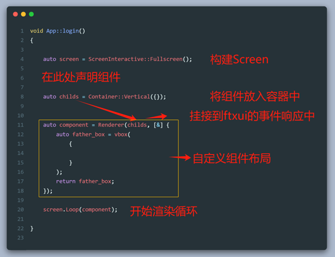

# 63.学生成绩管理系统的设计与实现

## 小组成员

**周子豪 邓嘉俊 王嘉俊**

## 问题描述

能够实现对学生成绩的常用管理功能。

## 基本要求

1. 采用一定的存储结构对学生成绩进行管理
2. 可以进行成绩的录入、查询、修改、删除等操作
3. 可以查询某门课程的平均分,学生的排名,不同分数段的学生人数及学生信息等
4. 可以查询某学生的各课程分数,总分及学生的班级排名等
5. 可以按学号排序输出全部学生的成绩信息、总分及班级排名等

## 项目打开方法

1. 先打开 `Visual Studio 2022`
2. 选择 `打开本地文件夹`

   
3. 打开本项目文件夹即可

## 项目编译方法

1. 在VS2022中点击 `项目`,再点击 `配置

   备注:部分电脑第一次自动配置可能会被VS2022报错,此时您只需再次重复此步骤,再次配置即可

   
2. 配置完成后即可运行

   

## 数据库设计

我们采用了嵌入式数据库sqlite。以下是我们的数据库架构：
	

## UI框架: ftxui

- 界面的美观主要通过使用ftxui库来实现，这是一个用于构建文本用户界面(TUI)的C++库。
- ftxui采用了声明式的编程风格，我们可以通过构建组件树来构建界面。
- ftxui的使用方法类似于HTML和CSS，我们可以对组件进行样式设置，使得界面更加美观。例如我们可以使用border函数为组件添加边框，使用color函数为组件添加颜色
